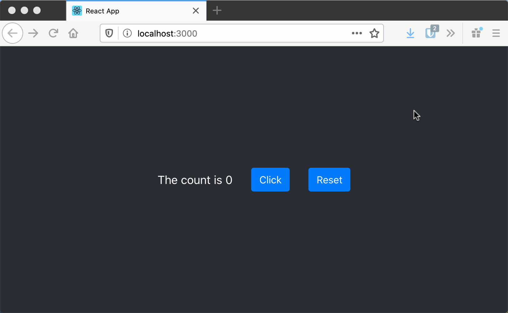

# react-clicker
Travail sur le state de React

# But
Vous devez créé une application React qui va contenir un clicker qui compte le nombre de fois qu'un bouton est clicker.
Il doit avoir aussi un deuxième bouton qui permet de "reset" le compteur.

# Élément fourni
* Le module react-bootstrap fait partie de l'installation du projet (avec `npm install`)
* Un exemple d'un `Button` avec react-bootstrap dans le [App.js](src/App.js)

# Requis technique
* Un component nommé Clicker qui doit contenir dans son state le nombre de click fait.
* Le component Clicker doit contenir deux boutons fait à partir du module bootstrap-react :
    * Un qui incrémente le nombre de click
    * Un qui réinitialise le compteur du nombre de click

# Test
Le test vérifie que un compteur indique le nombre de click. Que l'incrémentation et que le reset fonctionne.

# Extra
Pour le component Clicker, utiliser le [grid](https://react-bootstrap.netlify.app/layout/grid/) de react-bootstrap
pour bien placer les éléments du Clicker.

# Exemple du projet complété

# Exemple du projet avec l'extra

